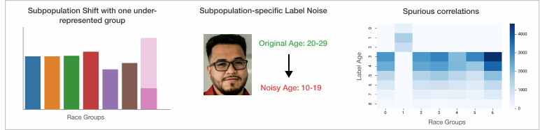

<div align="center">
<h1 style="font-family:">
  <b>Benchmarking Robustness to Natural Distribution Shifts for Facial Analysis</b><br>
</h1>
</div>

<div align="center"> 
    <em> A repository for various data/label bias experiments <em>
    <br> 
</div>

<div align="center">         
    
</div>

        
## Table of Contents

- [Table of Contents](#table-of-contents)
- [About <a name = "about"></a>](#about-)
- [Distribution Shifts <a name = "shifts"></a>](#distribution-shifts-)
- [Structure <a name = "structure"></a>](#structure-)
- [Getting Started <a name = "getting_started"></a>](#getting-started-)
- [Data <a name = "data"></a>](#data-)
  - [Prerequisites <a name = "prerequisites"></a>](#prerequisites-)
  - [Training <a name = "training"></a>](#training-)
  - [Names of shifts <a name = "shift_naming"></a>](#names-of-shifts-)
    - [Subpopulation shift with one under-represented attribute <a name = "subpopulation_shift"></a>](#subpopulation-shift-with-one-under-represented-attribute-)
      - [Subpopulation shift for gender <a name = "subpopulation_shift_gender"></a>](#subpopulation-shift-for-gender-)
      - [Subpopulation shift for race <a name = "subpopulation_shift_race"></a>](#subpopulation-shift-for-race-)
    - [Label noise for one attribute <a name = "label_noise"></a>](#label-noise-for-one-attribute-)
    - [spurious correlations <a name = "spurious"></a>](#spurious-correlations-)
- [Used Methods <a name = "methods"></a>](#used-methods-)

        
## About <a name = "about"></a>

The goal is to analyze the effects of various types of data and label shifts on the parameters accuracy, ECE, NLL, Confidence, and more.
Thus, we introduce several natural distribution shifts using a facial dataset and investigate their impact, mainly on on accuracy and calibration (ECE).

A link to our paper will be included.

## Distribution Shifts <a name = "shifts"></a>
        
* Subpopulation shift with one under-represented attribute
* Label noise for one attribute
* spurious correlations         


        

## Structure <a name = "structure"></a>
```

├── base                   
├── data_loader            
├── images                 
├── logger                 
├── model                  
   ├── architectures       
   ├── augmentation        
   ├── backbones           
   ├── metrics             
   ├── optim               
├── train                  
├── utils                  
├── parse_config.py        
└── README.md


```

## Getting Started <a name = "getting_started"></a>


## Data <a name = "data"></a>

Fairface Dataset available here: 
https://github.com/dchen236/FairFace \
by 
Karkkainen, K., & Joo, J. (2021). FairFace: Face Attribute Dataset for Balanced Race, Gender, and Age for Bias Measurement and Mitigation. In Proceedings of the IEEE/CVF Winter Conference on Applications of Computer Vision (pp. 1548-1558).

License: CC BY 4.0

### Prerequisites <a name = "prerequisites"></a>
- Python 3.6+
- PyTorch 1.3+
- PyTorch Lightning 1.3.8
- pandas 1.3.4
- numpy 1.21.1
- scikit-learn 1.0
- torchvision 0.10.1

### Training <a name = "training"></a>

- there are four spots where path variables have to be set:
  - in `base/base_data_loader` adapt `DATA_PATH` to point to the folder where all your data is stored
  - in parse_config specify `os.environ["MODEL_LOCATION"]` as the location where to save imagenet weights  
  - in `data_loader/datasets/affective_computing/fairface.py` change `PATH` to the foldername of the FairFace data, probably `"FairFace"`
  - in `training/data_shifts/configs/config.yml` change `save_dir` to the location where the npy (and if wished csv) files, generated by the training, should be saved
- navigate to `training/data_shifts/`
- specify the kind of experiment to run in `configs/config.yml` by editing `"group"`
- Alternatively, to run multiple experiments edit `create_sh.py`. Here you can choose what type of experiment to run
- select if predictions should be saved as `csv` and `npy` by setting `csv=True` in `configs/config.yml`
  - the `csv` files give information about various metrics (e.g. accuracy and ece) for specific subgroups
  - In our paper we used the `.npy` files to create ensembles (three runs form one ensemble)
- run the code either by executing `train.py` or `train.sh` (if created by `create.sh`)


### Names of shifts <a name = "shift_naming"></a>
the kind of shift is defined in config.yml under group.
#### Subpopulation shift with one under-represented attribute <a name = "subpopulation_shift"></a>
##### Subpopulation shift for gender <a name = "subpopulation_shift_gender"></a>
- "baseline_gender" (the baseline experiment for this block)
- "split_gen_1" (no women)
- "split_gen_2" (no men)
- "split_gen_3" (less women)
- "split_gen_4" (less men)

##### Subpopulation shift for race <a name = "subpopulation_shift_race"></a>
- "baseline_race" (the baseline experiment for this block)
- "data_shift_" + x + "_0.75" (only 25% of race group x included)
- "data_shift_" + x + "_0.5" (only 50% of race group x included)
- "data_shift_" + x + "_0.25" (only 75% of race group x included)
- "data_shift_" + x + "_0.0" (no subjects of race group x included)

for x in {"Black", "East Asian", "Indian", "Latino_Hispanic", "Middle Eastern", "Southeast Asian", "White"}

#### Label noise for one attribute <a name = "label_noise"></a>
- "baseline_race" (the baseline experiment for this block)
- "left_label_shift_" + x + "_0.5" (make all subjects from race group x younger by a Gaussian distribution with sigma 0.5)
- "left_label_shift_" + x + "_1.0" (make all subjects from race group x younger by a Gaussian distribution with sigma 1.0)
- "left_label_shift_" + x + "_1.5" (make all subjects from race group x younger by a Gaussian distribution with sigma 1.5)
- "left_label_shift_" + x + "_2.0" (make all subjects from race group x younger by a Gaussian distribution with sigma 2.0)
- "left_label_shift_" + x + "_2.5" (make all subjects from race group x younger by a Gaussian distribution with sigma 2.5)
- "left_label_shift_" + x + "_3.0" (make all subjects from race group x younger by a Gaussian distribution with sigma 3.0)
- "left_label_shift_" + x + "_3.5" (make all subjects from race group x younger by a Gaussian distribution with sigma 3.5)
- "left_label_shift_" + x + "_4.0" (make all subjects from race group x younger by a Gaussian distribution with sigma 4.0)


for x in {"Black", "East Asian", "Indian", "Latino_Hispanic", "Middle Eastern", "Southeast Asian", "White"}
#### spurious correlations <a name = "spurious"></a>        
- "spurious_correlations_baseline_young" (the baseline experiment for this block)
- "spurious_correlations_young_" + x (all young subjects from race groups other than x are excluded)
- "spurious_correlations_iff_young_" + x (all young subjects from race groups other than x are excluded)

for x in {0,1,2,3,4,5,6}, 

where each number corresponds to a race group like this:

{"Black": 0,
"East Asian": 1,
"Indian": 2,
"Latino_Hispanic": 3,
"Middle Eastern": 4,
"Southeast Asian": 5,
"White": 6}

## Used Methods <a name = "methods"></a>
- deep ensembles
  - paper: Lakshminarayanan, Balaji, Alexander Pritzel, and Charles Blundell. "Simple and scalable predictive uncertainty estimation using deep ensembles." arXiv preprint arXiv:1612.01474 (2016).
- mixup
  - Thulasidasan, Sunil, et al. "On mixup training: Improved calibration and predictive uncertainty for deep neural networks." arXiv preprint arXiv:1905.11001 (2019).
- temperature scaling
  - Guo, Chuan, et al. "On calibration of modern neural networks." International Conference on Machine Learning. PMLR, 2017.
- ResNet
  - He, Kaiming, et al. "Deep residual learning for image recognition." Proceedings of the IEEE conference on computer vision and pattern recognition. 2016.
